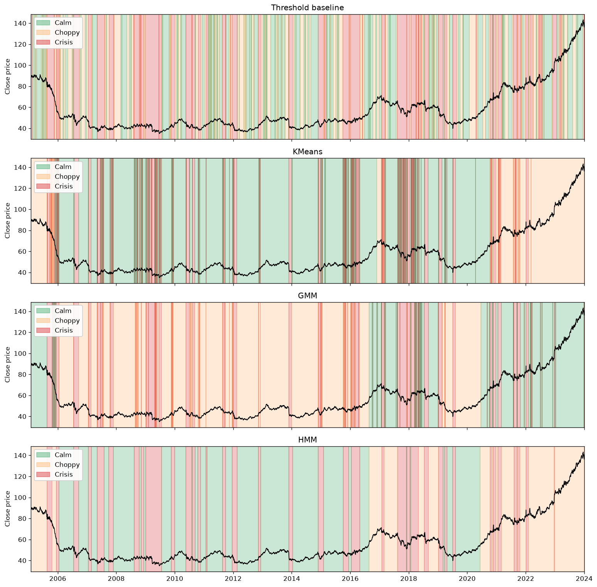
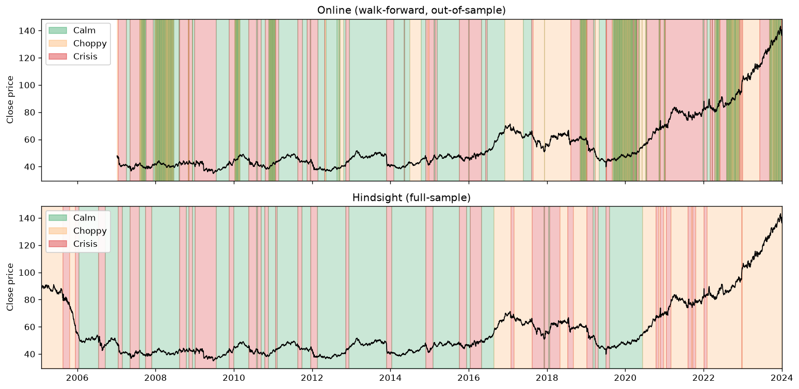
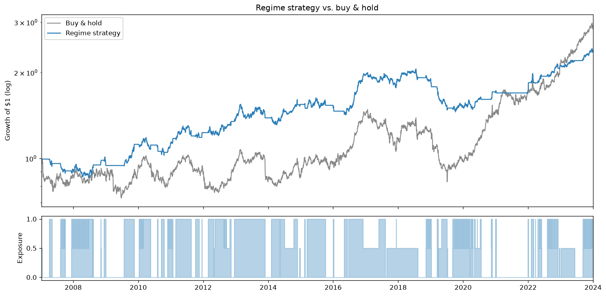
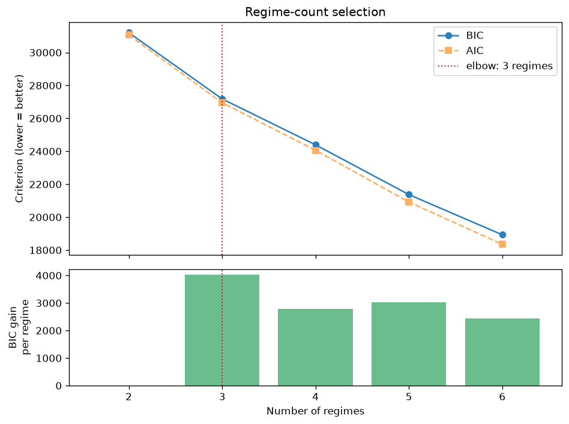

# Market Regime Detector


Detect hidden **market regimes** — calm, choppy, and crisis states — from daily
price data, using four models across three approaches (a volatility-threshold
baseline, clustering, and a Gaussian Hidden Markov Model), then testing whether
the resulting signal actually holds up **out-of-sample**.

> ⚠️ **Research prototype, not a trading system.** This project demonstrates the
> modelling and engineering behind regime detection. It is deliberately *not*
> suitable for live execution — see [Limitations](#limitations). That gap is the
> point: knowing where the line is between a prototype and production is the
> skill being shown.



*S&P 500 close price shaded by detected regime. Notice how the threshold baseline
(top) flickers between regimes constantly, while the HMM (bottom) — which models
regime **transitions** — produces stable, economically-meaningful blocks.*

---

## Contents

- [What it does](#what-it-does) — the four models and the headline result
- [Quickstart](#quickstart) — install and run in two commands
- [Walk-forward](#walk-forward-does-it-work-out-of-sample) — out-of-sample evaluation
- [Backtest](#does-the-signal-add-value-a-backtest) — does the signal add value?
- [Choosing the number of regimes](#choosing-the-number-of-regimes) — BIC elbow selection
- [How it works](#how-it-works) — pipeline and project structure
- [Limitations](#limitations) — **read this** — why it's not tradeable
- [Testing](#testing) · [Tech stack](#tech-stack)

---

## What it does

Given a price series, it fits four regime models and characterizes what each
detected regime looks like economically:

| Method | Idea | Models persistence? |
|---|---|---|
| **Threshold baseline** | Bucket days by realized-volatility quantile | ❌ |
| **KMeans** | Cluster days in feature space | ❌ |
| **Gaussian Mixture (GMM)** | Soft-cluster days as a mix of Gaussians | ❌ |
| **Gaussian HMM** | Hidden states with a learned transition matrix | ✅ |

The **Hidden Markov Model** is the centerpiece. It's the canonical approach to
regime detection because it explicitly models the market as switching between
*hidden* states, each with its own return/volatility distribution, and learns
how sticky those states are. The other three exist to give the HMM something to
beat.

### Representative result

Running on ~19 years of daily data, the HMM switches regimes **far** less often
than the naive baseline while still capturing every major drawdown:

| Model | Regime switches | Avg. regime length |
|---|---|---|
| Threshold baseline | 414 | 12 days |
| KMeans | 458 | 11 days |
| GMM | 307 | 16 days |
| **HMM** | **74** | **66 days** |

And the HMM's regimes are economically distinct — the highest-volatility regime
is a genuine drawdown state (negative return, ~2× the volatility of the calm
regime), not just "days that happened to be bumpy."

---

## Quickstart

```bash
pip install -r requirements.txt

# Run the full pipeline: download -> features -> 4 models -> plots + stats
python -m regime_detector --ticker SPY --regimes 3
```

Outputs land in `reports/`:
- `regime_comparison.png` — the shaded price chart above
- `hmm_regime_summary.csv` — per-regime economics (return, vol, Sharpe, drawdown)
- `stability.csv` — switch counts / persistence by model

CLI options: `--ticker`, `--start`, `--end`, `--regimes`, `--outdir`, `--no-plots`.

> **Data:** prices come from Yahoo Finance via `yfinance` and are cached under
> `data/`. If the network is unavailable, the pipeline **automatically falls back
> to a deterministic synthetic series** with three baked-in regimes, so the code
> (and the test suite) runs anywhere, offline. The committed figure above was
> produced from the synthetic fallback; point it at a network-connected machine
> to analyze real SPY.

Add `--walk-forward` for the out-of-sample evaluation, `--backtest` for that plus
the regime-conditioned strategy, or `--auto-regimes` to pick the regime count from
the data:

```bash
python -m regime_detector --ticker SPY --walk-forward
python -m regime_detector --ticker SPY --backtest       # ~40s
python -m regime_detector --ticker SPY --auto-regimes
```

The narrated walkthrough lives in [`notebooks/analysis.ipynb`](notebooks/analysis.ipynb).

---

## Walk-forward: does it work out-of-sample?

The four models above are fit on the *entire* history and read regimes off with
hindsight — useful for describing regimes, but not how a live system works. The
walk-forward evaluation fixes that for the HMM: it refits on an **expanding
window** and, at each day, assigns a regime using **only data available up to
that day** (filtered / online inference — no future leakage).



*Top: real-time regime calls. Bottom: hindsight. The white gap on the left is
the warm-up period before enough history exists to make a call. The online panel
is noisier because, in real time, you can't yet know how a stretch resolves.*

On the representative run the online detector **agrees with hindsight ~65%** of
days and catches the crisis regime with a **mean lag of ~1 day** — it reacts
fast, but the disagreement quantifies exactly how much of the clean hindsight
picture is unavailable in real time. That honesty is the point: it turns "here
are the regimes" into "here is what you'd actually have known, and when."

Implementation: [`walkforward.py`](src/regime_detector/walkforward.py). Standardization
and volatility-based relabeling are both computed **within each window**, so no
statistic ever leaks from the future.

---

## Does the signal add value? A backtest

The payoff question: if you tilt exposure by the **online** regime call — full
in calm, half in choppy, out in crisis — do you do better than just holding SPY?
Two rules keep it lookahead-free: the signal is the out-of-sample walk-forward
regime, and the regime known at today's close sets *tomorrow's* position. A
transaction cost is charged on every exposure change.



*Top (log scale): growth of $1. Bottom: strategy exposure — it steps down to
cash when the online detector flags stress. The strategy sidesteps the deep
drawdowns instead of riding them down.*

| | Regime strategy | Buy & hold |
|---|---|---|
| CAGR | 5.0% | 6.1% |
| Volatility | **9.2%** | 15.8% |
| Sharpe | **0.58** | 0.45 |
| Max drawdown | **−29%** | −44% |
| Calmar | **0.17** | 0.14 |

**The honest read:** the strategy gives up some total return (it sits in cash
during crises, missing sharp rebounds) but delivers **higher risk-adjusted
returns** — lower volatility, a better Sharpe, and a much shallower worst
drawdown. That is what a working regime signal should buy you: *risk management*,
not a free lunch. The exposure weights are fixed and un-optimized on purpose —
tuning them on this same data would be overfitting.

Implementation: [`strategy.py`](src/regime_detector/strategy.py). Reproduce with
`python -m regime_detector --backtest`.

---

## Choosing the number of regimes

Three regimes was a modelling choice, not a law. `--auto-regimes` selects the
count from the data with information criteria — and surfaces a subtlety worth
knowing.



*Top: BIC/AIC keep falling as regimes are added — no clear minimum. Bottom: the
marginal BIC gain per added regime, which peaks at 3.*

Naive **BIC/AIC minimization over-selects HMM states on financial data**: the
Gaussian-emission assumption is imperfect, so each extra state keeps improving
the likelihood and the raw minimum just runs to the largest candidate (6 here).
So the default rule is the **elbow** — the count past which adding a regime stops
meaningfully improving the fit. It lands on **3 regimes**, matching the
calm/choppy/crisis structure, while the raw BIC minimum would have picked 6.

Choosing the elbow over the raw optimum is the point: an information criterion is
a guide, not an oracle. Implementation: [`selection.py`](src/regime_detector/selection.py),
run with `python -m regime_detector --auto-regimes`.

---

## How it works

1. **Features** (`features.py`) — from the close price: log returns, rolling
   annualized realized volatility, downside volatility, drawdown-from-peak, and a
   rolling return z-score. All causal (past/present only).
2. **Models** (`models/`) — each returns an integer regime label per day. Labels
   are **relabeled by volatility** so regime 0 is always the calmest state,
   making models and runs directly comparable.
3. **Evaluation** (`evaluate.py`) — because regimes are unsupervised there is no
   ground truth to score against; instead we measure per-regime economics
   (return / vol / Sharpe / drawdown) and persistence (switch count, run length).
4. **Plots** (`plots.py`) — the price line shaded by regime, one panel per model.
5. **Walk-forward** (`walkforward.py`) — expanding-window, out-of-sample HMM with
   detection-lag metrics (see the section above).
6. **Backtest** (`strategy.py`) — regime-conditioned exposure vs. buy-and-hold,
   built only on the online signal with a next-day execution lag and costs.
7. **Selection** (`selection.py`) — data-driven regime count via the BIC elbow,
   robust to the over-selection that plagues raw information-criterion minima.

```
src/regime_detector/
├── data.py          # download + cache + synthetic fallback
├── features.py      # feature engineering
├── models/
│   ├── baseline.py  # volatility-threshold rules
│   ├── clustering.py# KMeans / GMM
│   ├── hmm.py       # Gaussian HMM  ← centerpiece
│   └── base.py      # volatility-ordered relabeling
├── walkforward.py   # out-of-sample expanding-window HMM + lag metrics
├── strategy.py      # regime-conditioned backtest (lookahead-free)
├── selection.py     # BIC/AIC + elbow regime-count selection
├── evaluate.py      # regime-conditional stats
├── plots.py         # shaded regime charts
└── cli.py           # end-to-end pipeline
```

---

## Limitations

Read this section — it's the most important one.

- **Lookahead in the default views.** The four-model comparison and the
  per-regime stats are computed on the full sample. The **`--walk-forward` path
  removes this** (expanding-window refit, in-window standardization, online
  inference), but it is opt-in and covers only the HMM — the headline charts are
  still hindsight.
- **The backtest is illustrative, not a strategy.** It charges a simple linear
  transaction cost but ignores slippage, borrowing/short constraints, and taxes;
  it trades a single instrument daily at the close; and the regime→exposure map
  is hand-set. It shows the *signal* has value, not that this is a deployable
  strategy.
- **Non-stationarity.** `--auto-regimes` picks the regime count from the data,
  but that count (and the fitted dynamics) are still assumed **fixed over the
  whole history**. Markets drift over decades; a truly adaptive model would let
  the regime structure itself evolve.
- **Single asset, single frequency.** Daily equity-index data only.

Any of these would need to be addressed before the output could inform a real
trade. A multi-asset extension and a rolling (time-varying) regime structure are
the natural next steps.

---

## Testing

```bash
pytest -q          # 20 tests, ~18s, no network required
```

The suite runs fully offline against the synthetic data and checks the invariants
that matter across the whole pipeline:

- **Features** are causal and NaN-free; drawdown is never positive.
- **Regime labels** are volatility-ordered, valid for 2–4 regimes, and the
  highest-vol regime really is a drawdown state.
- **The HMM** is stickier (fewer switches) than the naive baseline.
- **Walk-forward** has no calls during warm-up and its online agreement with
  hindsight sits strictly between chance and perfect — i.e. it's correlated but
  genuinely out-of-sample.
- **The backtest** uses a lagged signal (no lookahead), de-risking cuts max
  drawdown, transaction costs drag returns, and zero exposure earns exactly zero.
- **Regime-count selection** returns a valid candidate and the elbow is more
  parsimonious than the raw BIC minimum (it never just runs to the largest count).

## Tech stack

Python · pandas · NumPy · scikit-learn · **hmmlearn** · matplotlib · yfinance · pytest

## License

Released under the [MIT License](LICENSE).
